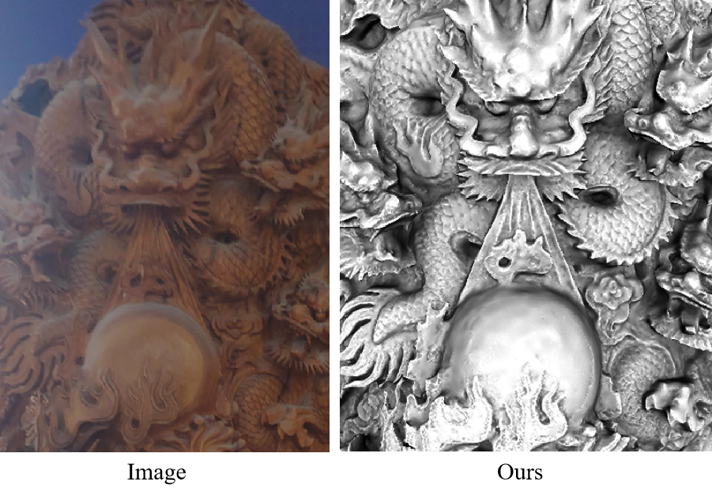
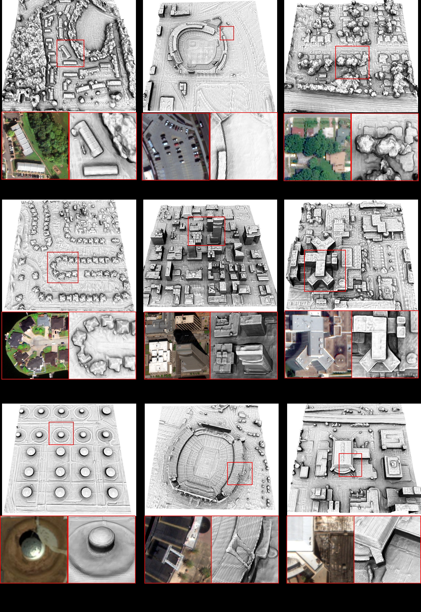
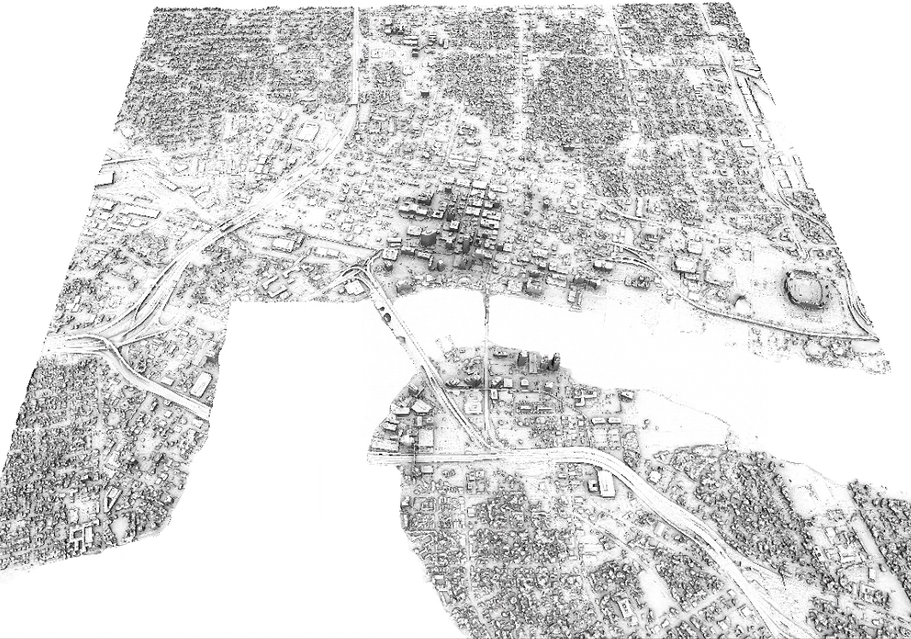
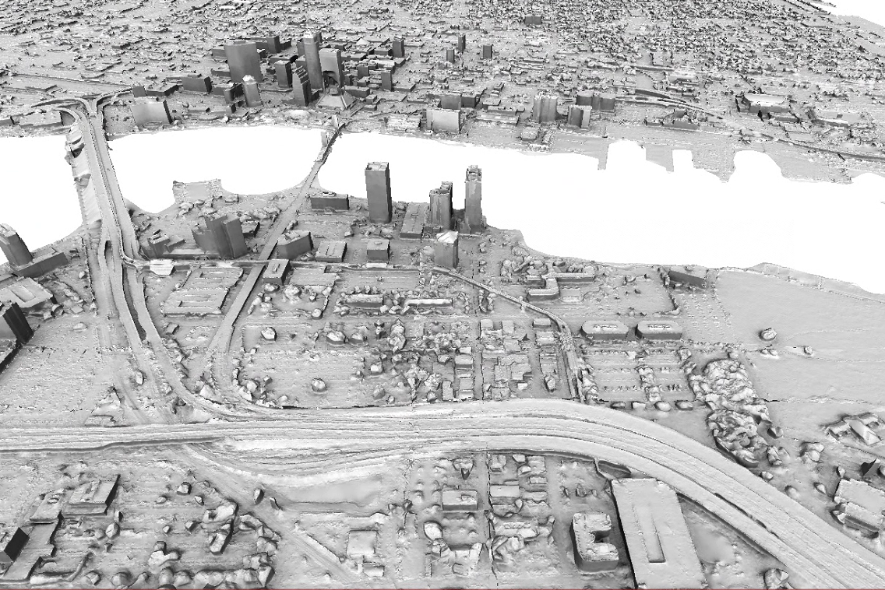
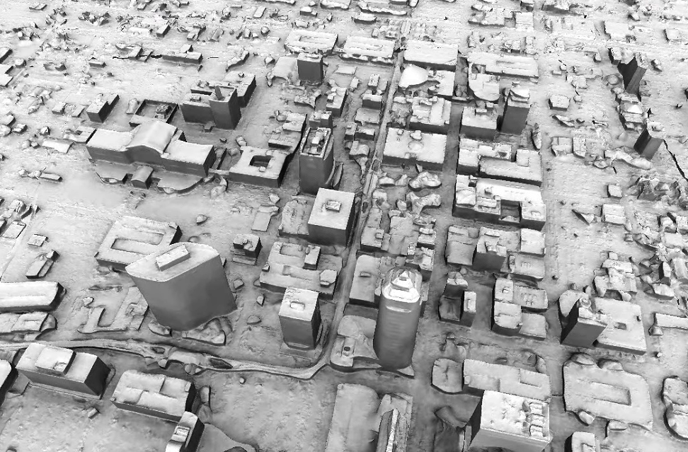

# Personal information

Address: School of Geodesy and Geomatics, Wuhan University, Wuhan, Hubei, 430079, P.R. China  

E-mail: quyj_whu@whu.edu.cn   

GitHub: https://github.com/jieeeeeeeeeee  

## Education

**Ph.D. in Photogrammetry and Computer Vision, 09/2020 ~ now**   
School of Geodesy and Geomatics, Wuhan University  
**Master in Photogrammetry and Computer Vision, 09/2017~06/2020**  
School of Geodesy and Geomatics, Wuhan University  
**Bachelor in Geographic Information System (GIS), 2013.09~2017.06**  
School of Hydraulic Science and Engineering, Zhengzhou University  

## Research experiences 

**High quality and low-noise Variational mesh refinement, 09/2018 - 06/2020**   
This is the sample result.  
  
  

**Multi-view 3d reconstruction for satellite images, 06/2020 - now**   
High-quality model reconstruction of multi-view images using neural radiation field technique. See https://jieeeeeeeeeee.github.io/sat-mesh/.

<video src="%E9%A3%9E%E4%B9%A620230910-085644.mp4" controls title="Title"></video>
<video src="%E9%A3%9E%E4%B9%A620230910-085506.mp4" controls title="Title"></video>
<video src="%E9%A3%9E%E4%B9%A620230910-085211.mp4" controls title="Title"></video>

**DSM refinement based on contour constraints, 2021** 

**Demo of satellite reconstruction in Florida, America(25km2). 2022** 

## Publications
[1]**Qu Y**., & Deng, F. (2023). Sat-Mesh: Learning Neural Implicit Surfaces for Multi-View Satellite Reconstruction. Remote Sensing, 15(17), 4297.   
[2] **Qu Y**, Yan Q, Deng F, et al. Total differential photometric mesh refinement with self-adapted mesh denoising. Photonics. 2023; 10(1):20. https://doi.org/10.3390/photonics10010020.   
[3] **Qu Y**, Yan Q, Deng F, et al. Satellite True Digital Orthophoto Map Generation Without Elevation Data: A New NeRF-based Method. International Journal of Remote Sensing Letter 