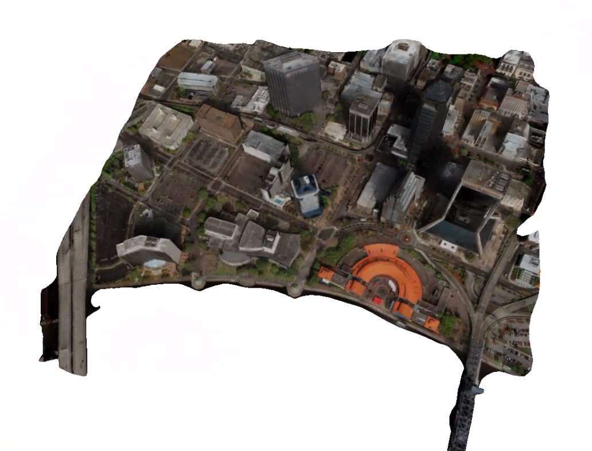
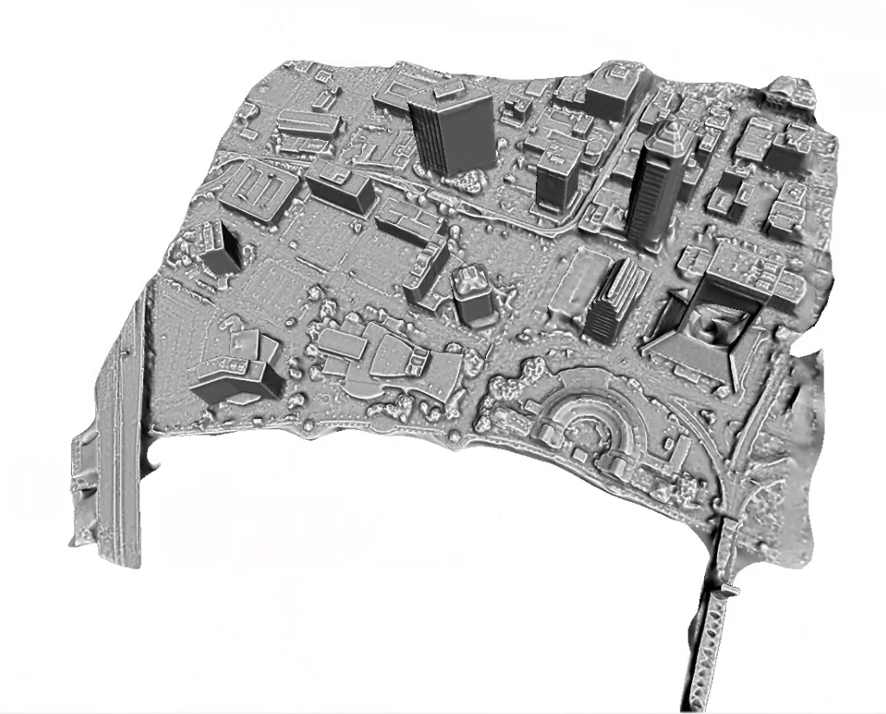
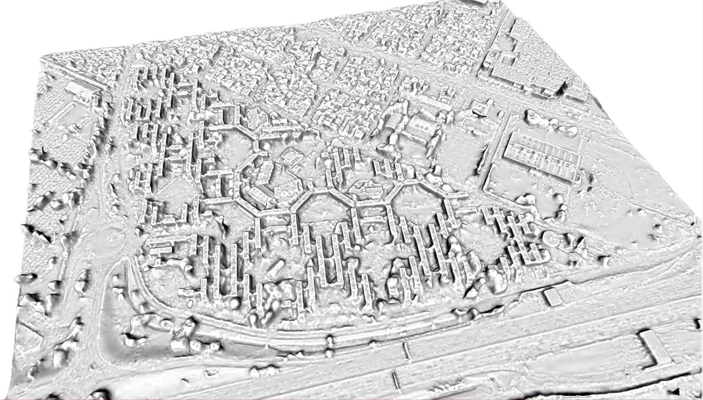
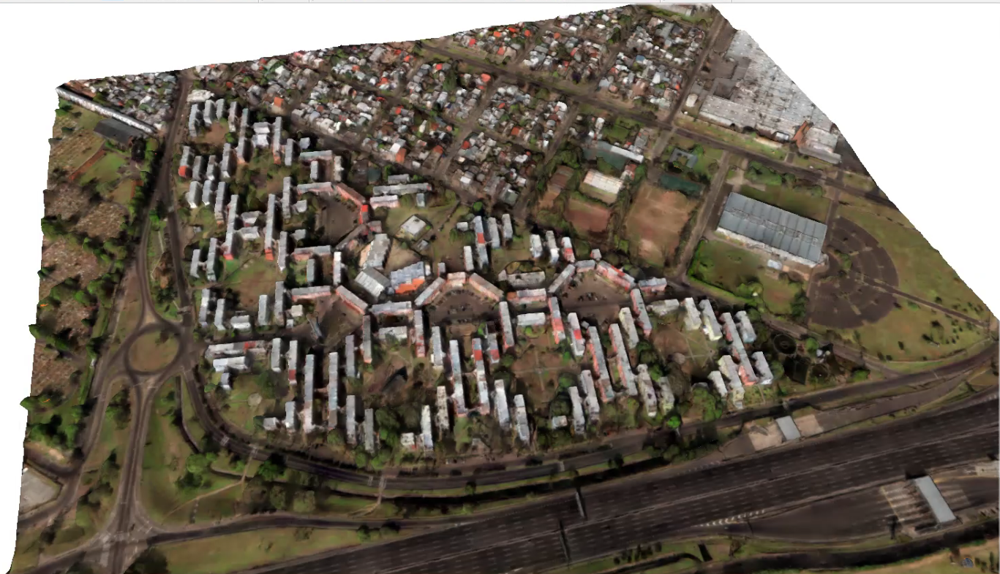
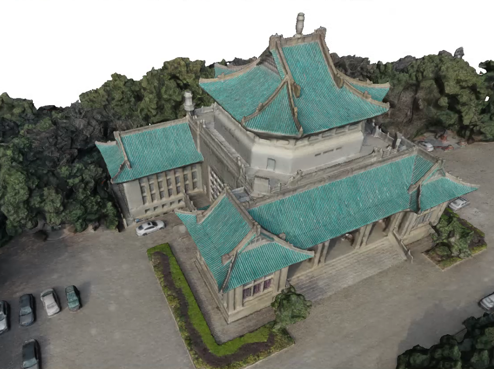
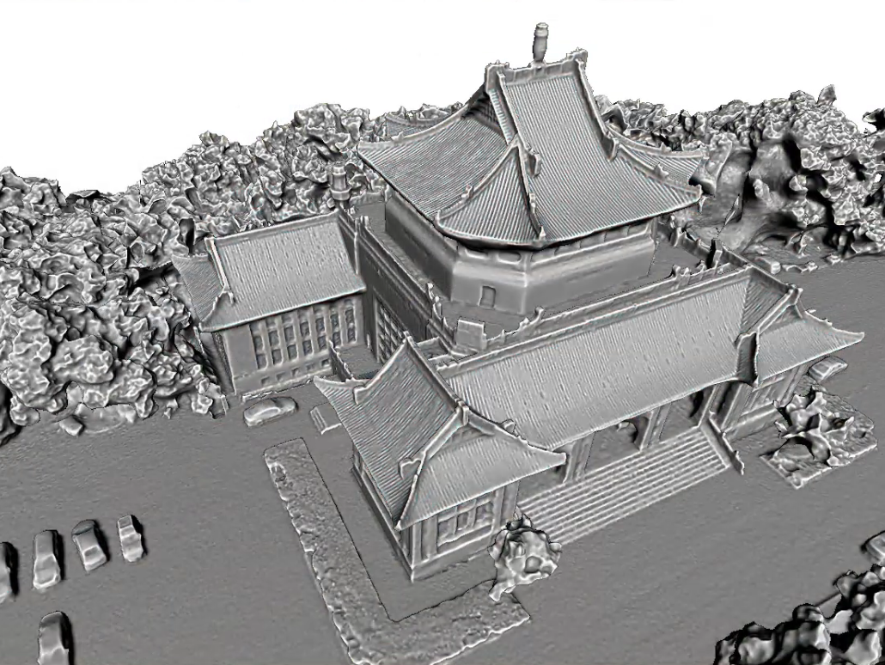
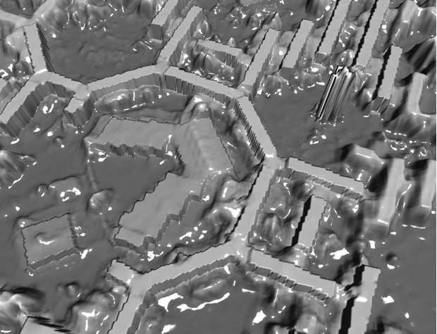
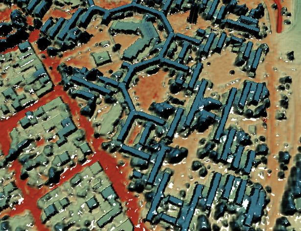

# Personal information

Address: School of Geodesy and Geomatics, Wuhan University, Wuhan, Hubei, 430079, P.R. China  

E-mail: quyj_whu@whu.edu.cn   

GitHub: https://github.com/jieeeeeeeeeee  

## Education

**Ph.D. in Photogrammetry and Computer Vision, 09/2020 ~ now**   
School of Geodesy and Geomatics, Wuhan University  
**Master in Photogrammetry and Computer Vision, 09/2017~06/2020**  
School of Geodesy and Geomatics, Wuhan University  
**Bachelor in Geographic Information System (GIS), 2013.09~2017.06**  
School of Hydraulic Science and Engineering, Zhengzhou University  

## Research experiences 

**Multi-view 3d reconstruction for satellite images, 06/2020 - now**   
Building a system of satellite image 3d reconstruction with RPC bundle adjustment, multi-view stereo, mesh reconstruction, mesh refinement and texture mapping.  
This is the sample result.

**High quality and low-noise Variational mesh refinement, 09/2018 - 06/2020**   
This is the sample result.  
  
  

**DSM refinement based on contour constraints, 2021** 

## Publications

[1] Zhu Y, Yan Q, **Qu Y**, et al. View selection strategy for photo-consistency refinement[J]. Acta Geodaetica et Cartographica Sinica, 2020, 49(11): 1463-1472.  
[2] Deng F, Chen X, Yan Q, **Qu Y**, et al. Variational refinement of mesh with line constraint for photogrammetry[J]. Acta Geodaetica et Cartographica Sinica, 2020, 49(4): 469-479.